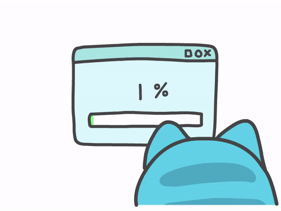

<!--  -->

<h3 align="left">About Me</h3>

 💼 **Atualmente:** Atuo com infraestrutura, redes e suporte de sistemas ERP na Fecularia Lopes, e sou estudante de Engenharia de Software.
 🎯 **Objetivo:** Em busca da minha primeira oportunidade oficial como desenvolvedor (Front-end/Mobile).
 ⚙️ **Foco Técnico:** Desenvolvimento web (PHP, Laravel, React), automação de fluxos (n8n) e testes com IA generativa.
 🚀 **Projetos:** Criador do aplicativo de controle financeiro **Finan**, focado em simular desafios e cenários reais do mercado de trabalho.
 🎤 **Destaque:** Palestrante convidado no Senac PR (Painel Encontro de Saberes).
 🎨 **Além do código:** Nas horas vagas, divido meu tempo entre treinos de força, jogos de tabuleiro e ilustrações digitais.

 

<h3 align="left">Connect with me!</h3>

&nbsp;&nbsp;

&nbsp;&nbsp;

&nbsp;&nbsp;

<h3 align="left">My Stack ~</h3>

  
  
  

 

  
  
  

