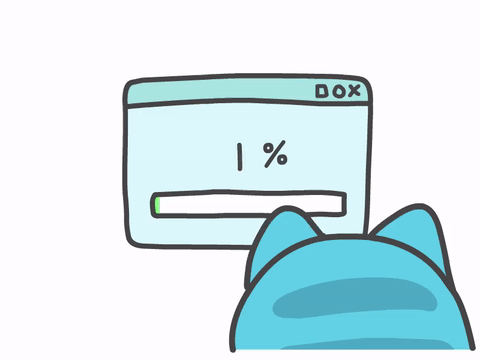

#

Sou estudante de <strong>Análise e Desenvolvimento de Sistemas</strong> e <strong>Informática para Internet</strong>, atualmente cursando <strong>Engenharia de Software</strong>. Apaixonado por transformar ideias em <strong>soluções digitais</strong> bem estruturadas, funcionais e criativas, estou sempre em busca de novos desafios que me permitam crescer e aprimorar minhas habilidades.

Acredito no poder do <strong>aprendizado contínuo</strong>, da <strong>colaboração</strong> e das <strong>boas práticas</strong> para gerar impacto real através da tecnologia. Meu objetivo é construir uma carreira sólida como <strong>engenheiro de software</strong>, contribuindo com projetos que façam a diferença.

#

<h3 align="left">Connect with me!</h3>

<h3 align="left">My Stack ~</h3>

  
  
  
  
  
  
  
  
  
  
  
  
  
  
  
  
  
  
  

 

<!--grafico--->

  
  

 
 
 

  
  

